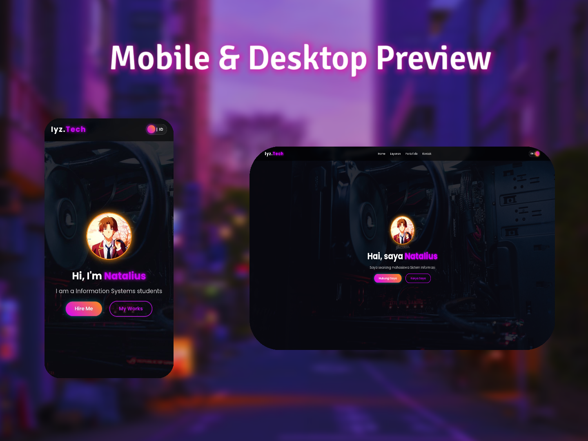

# 🌐 Modern Portfolio Website Template

A sleek, high-performance personal portfolio landing page built with a modern dark theme and vibrant neon accents. Designed specifically for developers, students, or creatives who want a professional web presence.

---

## 📸 UI Preview
Visual representation of the interface:

  

---

## ⚡ Key Features
*   **Modern Branding**: Glow-effect typography for a futuristic aesthetic.
*   **Glassmorphism UI**: High-end transparent cards and buttons for a clean look.
*   **Responsive Layout**: Fully optimized for mobile, tablet, and desktop screens.
*   **Interactive CTA**: Functional "Hire Me" and "My Works" call-to-action buttons.
*   **Fast Loading**: Lightweight code structure for optimal performance.

---

## 🛠️ Tech Stack
*   **HTML5**: Semantic and SEO-friendly structure.
*   **CSS3**: Advanced layouts using Flexbox, Grid, and Root Variables for easy color customization.
*   **Typography**: Integrated Google Fonts (Montserrat/Poppins).
